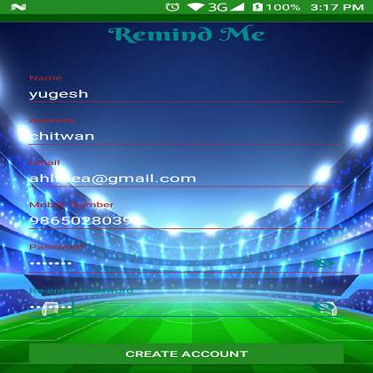
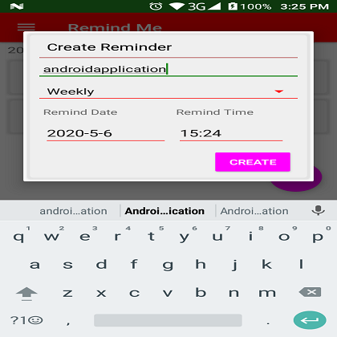
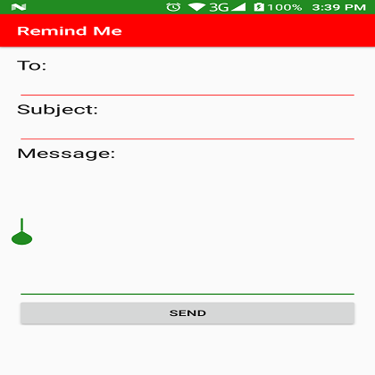

# Remind Me

## Screenshot

## Usage
Reminder application is a good way to track down the individual’s activities,
plans and reminding the important activities before the hand.
Which will increase the productivity and responsiveness towards the daily activities.
In this busy world most of the people, students, jobholders may forget things which can be important,
or which will make their life happier. With the intention to support these people this application is going to build.
 Users can add new tasks and set the reminder to it.
 User can also set reminder on the daily or weekly basis.
 Which will benefit the user in their productivity.
 The core feature of the application is to provide the correct information to the user in timely manner